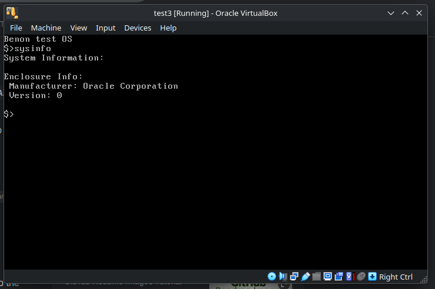

# test-os
A barebones monolithic kernel operating system I am building to advance my knowledge on OS concepts.

The core concepts for this repo come from my readings of Mr Lucus S Darnell's book "Create Your Own Operating System"

What is currently working:
- GNU Grub multiboot 1 bootloader
- Terminal Output to colored monitor interface
- Basic ASCII text I/O with terminal interface
- Basic smbios parsing for hardware identification
- You can load the .iso into Oracle Virtual Box and try it yourself

# Progress Screenshots

